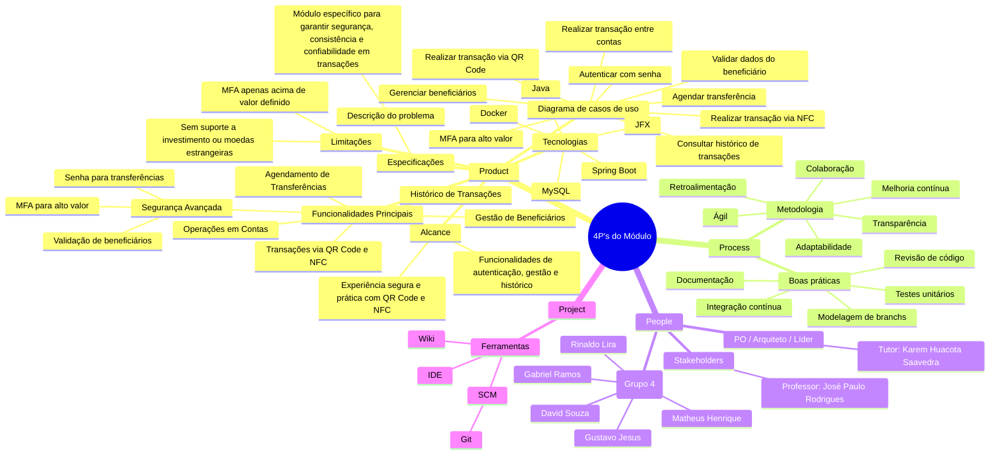

# Os 4P's do Módulo de Transações

Este documento apresenta uma visão geral do módulo de transações organizada segundo o framework dos 4P's: Product, Process, People e Project.

## Diagrama Conceitual

## Visão Integrada

O módulo de transações é um componente crítico do sistema bancário, desenvolvido com foco em segurança e usabilidade. A integração dos 4P's garante uma abordagem holística:

- **Product**: Define o que será construído, com foco nas necessidades do usuário
- **Process**: Estabelece como o desenvolvimento será conduzido
- **People**: Identifica quem está envolvido e suas responsabilidades
- **Project**: Organiza os recursos e ferramentas necessários

Para mais detalhes sobre cada aspecto, consulte as seções específicas:

- [Visão Geral do Produto](product-overview.md)
- [Processo de Desenvolvimento](process-overview.md)
- [Equipe e Stakeholders](people-overview.md)
- [Visão Geral do Projeto](project-overview.md)