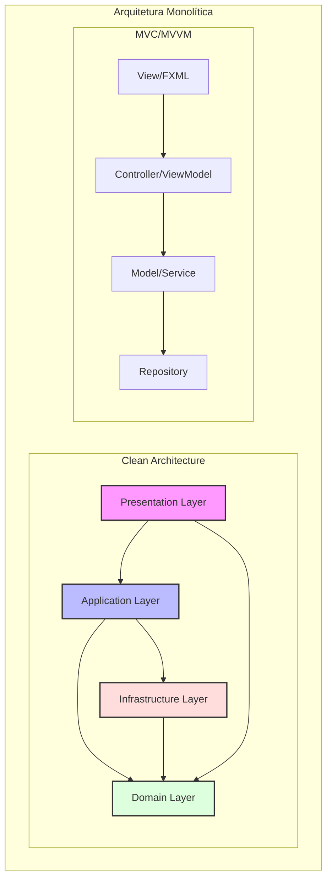
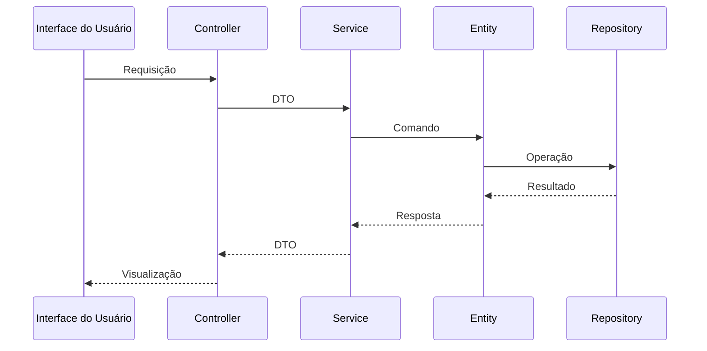

# Arquitetura

Esta seção documenta as arquiteturas de software utilizadas no Módulo de Transações, explicando como foram implementadas e quais benefícios trazem ao projeto.

## Clean Architecture

### Visão Geral

O Módulo de Transações implementa os princípios da Clean Architecture, uma abordagem proposta por Robert C. Martin (Uncle Bob) que organiza o código em camadas concêntricas com regras de dependência claras.

### Implementação no Projeto

A estrutura do projeto reflete as camadas da Clean Architecture:

```plaintext
src/
├── main/
│   ├── java/
│   │   └── org/jala/university/
│   │       ├── domain/         # Entidades e regras de negócio
│   │       ├── application/    # Casos de uso e regras de aplicação
│   │       ├── infrastructure/ # Implementações técnicas
│   │       └── presentation/   # Interface do usuário
```

1. **Domain Layer (Camada de Domínio)**
   - Contém as entidades de negócio e regras de domínio
   - Independente de frameworks e tecnologias
   - Exemplo: `Account.java`, `Transaction.java`

2. **Application Layer (Camada de Aplicação)**
   - Implementa casos de uso específicos
   - Orquestra o fluxo entre entidades e infraestrutura
   - Exemplo: `TransactionService.java`, `UserService.java`

3. **Infrastructure Layer (Camada de Infraestrutura)**
   - Implementa interfaces definidas nas camadas internas
   - Contém adaptadores para frameworks e tecnologias
   - Exemplo: `UserRepositoryImpl.java`, `JPAConfig.java`

4. **Presentation Layer (Camada de Apresentação)**
   - Interface com o usuário
   - Controladores e views
   - Exemplo: `LoginController.java`, `login-view.fxml`

### Benefícios no Projeto

1. **Testabilidade**
   - Camadas internas podem ser testadas independentemente
   - Mocks podem substituir implementações externas

2. **Independência de Frameworks**
   - Regras de negócio não dependem de frameworks
   - Facilita a troca de tecnologias (ex: mudar de JPA para outro ORM)

3. **Manutenibilidade**
   - Separação clara de responsabilidades
   - Código mais organizado e previsível

## MVC (Model-View-Controller)

### Visão Geral

O padrão MVC separa a aplicação em três componentes principais: Model (dados), View (interface) e Controller (lógica de controle). No contexto do JavaFX, este padrão é adaptado para a estrutura específica do framework.

### Implementação no Projeto

1. **Model**
   - Entidades de domínio e DTOs
   - Exemplo: `User.java`, `TransactionDTO.java`

2. **View**
   - Arquivos FXML que definem a interface
   - Exemplo: `login-view.fxml`, `transfer-view.fxml`

3. **Controller**
   - Classes que controlam a interação entre Model e View
   - Exemplo: `LoginController.java`, `TransferController.java`

### Benefícios no Projeto

1. **Separação de Responsabilidades**
   - Interface separada da lógica de negócio
   - Facilita alterações na UI sem afetar a lógica

2. **Reutilização de Código**
   - Views podem ser reutilizadas com diferentes controllers
   - Models podem ser usados em diferentes contextos

3. **Desenvolvimento Paralelo**
   - Equipes podem trabalhar simultaneamente em diferentes componentes

## Arquitetura Monolítica

### Visão Geral

Uma arquitetura monolítica encapsula todos os componentes da aplicação em um único processo ou artefato de implantação. Embora contraste com arquiteturas distribuídas como microserviços, pode ser apropriada para aplicações de escopo definido.

### Implementação no Projeto

O Módulo de Transações é implementado como uma aplicação monolítica:

1. **Empacotamento Único**
   - Toda a aplicação é empacotada em um único JAR
   - Implantação como uma unidade coesa

2. **Banco de Dados Compartilhado**
   - Todas as funcionalidades acessam o mesmo banco de dados
   - Transações ACID garantidas

3. **Processo Único**
   - Execução em um único processo JVM
   - Comunicação interna via chamadas de método diretas

### Benefícios no Projeto

1. **Simplicidade**
   - Desenvolvimento e implantação simplificados
   - Menor complexidade operacional

2. **Performance**
   - Comunicação eficiente entre componentes
   - Menor overhead de rede

3. **Consistência de Dados**
   - Transações atômicas entre diferentes partes do sistema
   - Integridade referencial garantida

## Diagrama de Arquitetura



## Considerações de Design

1. **Por que Clean Architecture?**
   - Promove a separação de responsabilidades
   - Facilita testes unitários
   - Protege regras de negócio de mudanças em frameworks

2. **Por que MVC?**
   - Adequado para aplicações desktop com JavaFX
   - Facilita a manutenção da interface do usuário
   - Permite binding de dados eficiente

3. **Por que Monolítico?**
   - Apropriado para o escopo atual do projeto
   - Simplifica o desenvolvimento e implantação
   - Reduz a complexidade operacional

## Princípios Arquiteturais

1. **Dependency Rule**
   - Dependências apontam para dentro
   - Camadas internas não conhecem externas
   - Inversão de dependência quando necessário

2. **SOLID**
   - Single Responsibility Principle
   - Open/Closed Principle
   - Liskov Substitution Principle
   - Interface Segregation Principle
   - Dependency Inversion Principle

3. **Clean Code**
   - Nomes significativos
   - Funções pequenas e focadas
   - Comentários apenas quando necessário
   - Formatação consistente

## Fluxo de Dados



Para mais detalhes sobre cada camada, consulte:
- [Domain Layer](domain-layer.md)
- [Application Layer](application-layer.md)
- [Infrastructure Layer](infrastructure-layer.md)
- [Presentation Layer](presentation-layer.md)

## Padrões de Projeto Utilizados

O Módulo de Transações implementa diversos padrões de design para melhorar a qualidade do código e facilitar a manutenção. Para uma visão detalhada, consulte a [seção de Padrões de Design](design-patterns.md).

Alguns dos principais padrões utilizados incluem:

1. **Repository Pattern**
   - Abstrai acesso a dados
   - Permite troca de implementação

2. **Factory Pattern**
   - Criação de objetos complexos
   - Centraliza lógica de instanciação

3. **MVVM Pattern**
   - Separa lógica de apresentação
   - Facilita testes unitários

4. **Adapter Pattern**
   - Converte interfaces incompatíveis
   - Facilita integração com sistemas externos

5. **Facade Pattern**
   - Simplifica subsistemas complexos
   - Fornece interface unificada

## Decisões Arquiteturais

### Banco de Dados
- MySQL para persistência
- Migrations para controle de schema
- Connection pool para performance

### Interface do Usuário
- JavaFX para GUI
- FXML para layouts
- CSS para estilização

### Segurança
- Autenticação baseada em tokens
- Criptografia de senhas
- Validação de inputs

## Considerações de Performance

1. **Otimizações**
   - Cache em memória
   - Queries otimizadas
   - Paginação de resultados

2. **Monitoramento**
   - Logs estruturados
   - Métricas de performance
   - Rastreamento de erros

## Evolução e Manutenção

1. **Versionamento**
   - Controle de versão com Git
   - Branches por feature
   - Semantic versioning

2. **Testes**
   - Testes unitários
   - Testes de integração
   - Testes end-to-end

3. **Documentação**
   - Javadoc para APIs
   - README atualizado
   - Diagramas atualizados