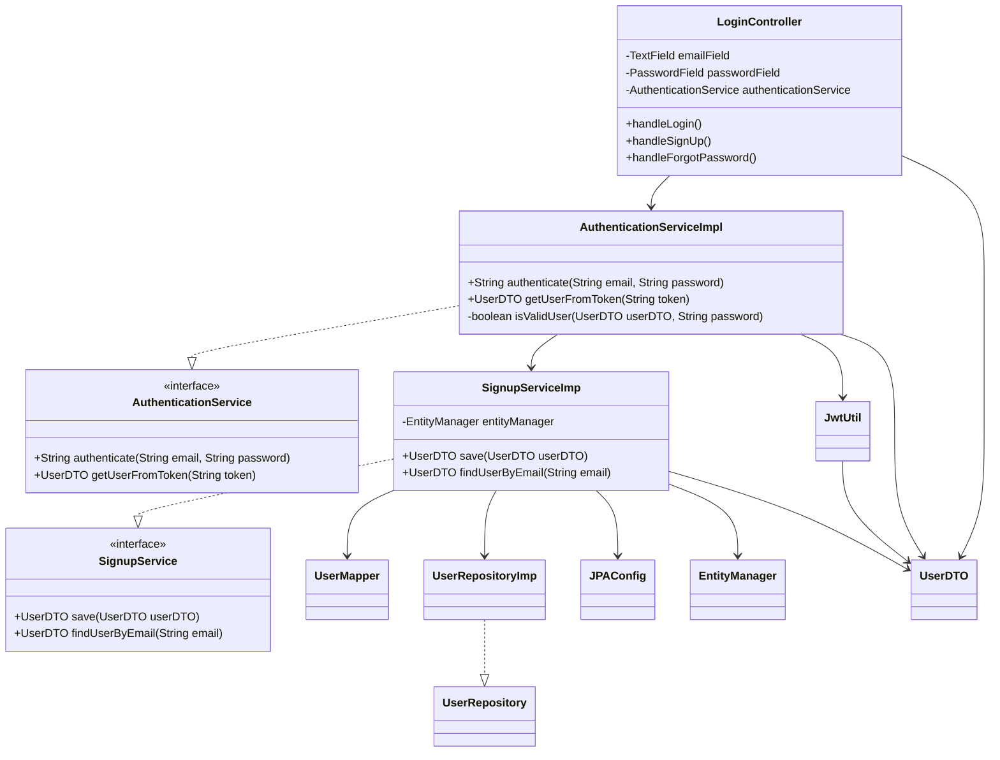

# Dependency Inversion Principle (DIP)

## Visão Geral

Injeção de dependência é uma forma de escrever código mais flexível e desacoplado. Em vez de uma classe criar diretamente os objetos que precisa para funcionar, ela recebe esses objetos de fora, geralmente por meio do construtor, de um método ou de um framework.

## Implementação no Projeto

A interface `AuthenticationService` atua como uma abstração da lógica de sua classe onde é implementada, servindo para desacoplamento, onde uma classe pode usar métodos de outra classe sem que saiba a sua lógica ou dependa da sua implementação.

```java
/**
 * Service that encapsulates the authentication of users.
 */
public interface AuthenticationService {

    /**
     * Authenticates a user and returns a JWT token that can be used to access protected resources.
     * @param email the user email
     * @param password the user password
     * @return a JWT token
     */
    String authenticate(String email, String password);

    /**
     * Retrieves a user from a given JWT token.
     * @param token the JWT token
     * @return the user associated with the token
     */
    UserDTO getUserFromToken(String token);
}
```

## AuthenticationServiceImpl como implementação

Onde consegue ter uma ou mais implementações, sendo a principal dela a `AuthenticationServiceImpl` onde fica sua real lógica.

```java
/**
 * Implementation of the authentication service that handles user authentication and token management.
 * This service is responsible for validating user credentials and managing JWT tokens.
 *
 * @version 1.0
 * @see AuthenticationService
 * @see SignupService
 * @see JwtUtil
 */
@Service
public class AuthenticationServiceImpl implements AuthenticationService {
    
    /** Service for user registration and retrieval operations */
    private final SignupService signupService;

    /**
     * Constructs a new AuthenticationServiceImpl.
     * Initializes the required signup service for user operations.
     */
    public AuthenticationServiceImpl() {
        this.signupService = new SignupServiceImp();
    }

    /**
     * Authenticates a user with their email and password.
     * If authentication is successful, generates and returns a JWT token.
     *
     * @param email    the user's email address
     * @param password the user's password in plain text
     * @return JWT token string if authentication is successful
     * @throws RuntimeException if the user is not found or credentials are invalid
     */
    @Override
    public String authenticate(String email, String password) {
        UserDTO userByEmail = signupService.findUserByEmail(email);
        if (!isValidUser(userByEmail, password)) throw new RuntimeException("Invalid user or password");
        return JwtUtil.generateToken(userByEmail);
    }

    /**
     * Retrieves user information from a JWT token.
     * Validates the token and extracts the user details.
     *
     * @param token the JWT token string
     * @return UserDTO containing the user information from the token
     * @throws RuntimeException if the token is blank or invalid
     */
    @Override
    public UserDTO getUserFromToken(String token) {
        if (token.isBlank()) throw new RuntimeException("Invalid token");
        return JwtUtil.getUserFromToken(token);
    }

    /**
     * Validates a user's password against the stored hash.
     * Uses BCrypt for secure password verification.
     *
     * @param userDTO  the user DTO containing the hashed password
     * @param password the plain text password to verify
     * @return true if the password is valid, false otherwise
     */
    private boolean isValidUser(UserDTO userDTO, String password) {
        return BCrypt.checkpw(password, userDTO.getPassword());
    }
}
```

## Uso No Código

```java
private final AuthenticationService authenticationService;

public LoginController() {
    this.authenticationService = new AuthenticationServiceImpl();
}
```

O construtor do `LoginController` recebe a injeção de dependência onde a interface recebe a instância de sua implementação, conseguindo assim acessar seus métodos de forma indireta através da interface.

```java
private void handleLogin() {
    String email = emailField.getText();
    String password = passwordField.getText();

    try {
        // Tenta autenticar
        String token = authenticationService.authenticate(email, password);
        UserDTO userFromToken = this.authenticationService.getUserFromToken(token);
```

No método `handleLogin` onde ele acessa seus métodos.

## Benefícios no Projeto

1. **Desacoplamento entre componentes**
   - O `LoginController` depende apenas da interface `AuthenticationService`, e não da sua implementação concreta. Isso reduz o acoplamento entre as classes e torna o código mais modular e fácil de entender.

2. **Facilidade para trocar implementações**
   - Como o controlador depende de uma abstração, é possível substituir a implementação por outra (como uma versão mockada ou uma integração com um serviço externo) sem modificar o código do consumidor.

3. **Aumento da testabilidade**
   - Durante os testes, é possível injetar implementações falsas ou controladas da interface, simulando diferentes comportamentos e cenários sem depender da lógica real de autenticação.

4. **Centralização da lógica de construção**
   - O ponto onde a implementação concreta é instanciada pode ser isolado (como em um framework de injeção ou classe de configuração), mantendo o restante do sistema limpo e sem responsabilidade de criar objetos.

5. **Flexibilidade e extensibilidade**
   - Novas formas de autenticação podem ser adicionadas ao sistema simplesmente criando novas classes que implementam a interface, sem precisar modificar os consumidores já existentes.

## Diagrama



## Considerações de Design

1. **Quando Usar**
   - Quando há necessidade de conectar camadas de alto nível (como serviços e controladores) com implementações de baixo nível (como repositórios JPA ou utilitários de criptografia) sem acoplamento direto.
   - Quando se deseja separar claramente as regras de negócio da infraestrutura técnica, mantendo o foco do sistema na lógica de domínio.

2. **Vantagens**
   - Torna o código mais limpo, modular, substituível e testável, pois as dependências são baseadas em abstrações e não em implementações concretas.
   - Facilita a troca de implementações (por exemplo, trocar um repositório real por um mock) sem impacto nas camadas superiores.
   - Permite maior facilidade na injeção de dependência e no uso de frameworks como Spring, promovendo boas práticas de teste e manutenção.
   - Reduz significativamente o acoplamento entre camadas, promovendo uma arquitetura mais estável e evolutiva.

3. **Complementaridade com outros padrões**
   - Integra-se bem com o padrão Adapter, que converte interfaces para atender as expectativas das camadas superiores.
   - É um dos pilares da Arquitetura Hexagonal (Ports and Adapters), reforçando a separação entre domínio e infraestrutura.
   - Trabalha em conjunto com o padrão Facade ao esconder complexidades de infraestrutura atrás de interfaces simples.
   - Facilita a implementação de testes unitários com mocks ou stubs ao permitir a substituição das dependências por versões controladas.