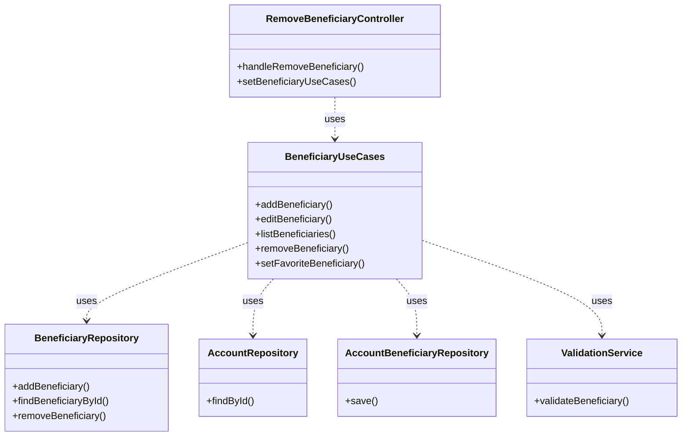

# Facade Pattern

## Visão Geral

O padrão **Facade** é um padrão estrutural que tem como objetivo fornecer uma interface simplificada para um conjunto de interfaces em um subsistema. Em outras palavras, ele oferece uma camada de abstração que centraliza e simplifica o acesso a diferentes componentes ou serviços de um sistema. No contexto do Módulo de Beneficiários, este padrão é utilizado para encapsular a complexidade dos diferentes repositórios e serviços, oferecendo uma interface simplificada e organizada para os casos de uso e o controlador.

## Implementação no Projeto

### BeneficiaryUseCases

A classe `BeneficiaryUseCases` atua como uma fachada, centralizando a lógica de negócios relacionada ao gerenciamento de beneficiários. Ela coordena o acesso aos repositórios e serviços necessários para realizar operações de adição, edição, listagem e remoção de beneficiários.

```java
public class BeneficiaryUseCases {
    private final BeneficiaryRepository beneficiaryRepository;
    private final AccountRepository accountRepository;
    private final AccountBeneficiaryRepository accountBeneficiaryRepository;
    private final ValidationService validationService;

    public BeneficiaryUseCases(
            BeneficiaryRepository beneficiaryRepository,
            AccountRepository accountRepository,
            AccountBeneficiaryRepository accountBeneficiaryRepository,
            ValidationService validationService) {
        this.beneficiaryRepository = beneficiaryRepository;
        this.accountRepository = accountRepository;
        this.accountBeneficiaryRepository = accountBeneficiaryRepository;
        this.validationService = validationService;
    }
}
```

### BeneficiaryUseCases como Facade

A classe `BeneficiaryUseCases` fornece métodos simplificados para os casos de uso que envolvem as operações de beneficiários. Através dessa interface, outras partes do sistema podem realizar operações complexas sem se preocupar com a lógica interna de cada repositório ou serviço utilizado.

#### Exemplos de Métodos no BeneficiaryUseCases

- **Adição de Beneficiário:**  
    O método `addBeneficiary` centraliza a lógica de validação, verificação de existência de beneficiários e criação da relação entre conta e beneficiário.
    

```java
public void addBeneficiary(BeneficiaryDTO beneficiaryDTO, Long accountId) {
    if (!validationService.validateBeneficiary(beneficiaryDTO)) {
        throw new IllegalArgumentException("Dados do beneficiário inválidos");
    }

    // Verificação e criação do beneficiário
    Account account = accountRepository.findById(accountId);
    Beneficiary beneficiary = new Beneficiary(beneficiaryDTO);
    beneficiaryRepository.addBeneficiary(beneficiary);

    // Criação da relação
    AccountBeneficiary accountBeneficiary = new AccountBeneficiary(account, beneficiary);
    accountBeneficiaryRepository.save(accountBeneficiary);
}
```

- **Remoção de Beneficiário:**  
    O método `removeBeneficiary` simplifica o processo de remoção, abstraindo a necessidade de lidar diretamente com repositórios de dados.
    

```java
public void removeBeneficiary(Long beneficiaryId) {
    beneficiaryRepository.removeBeneficiary(beneficiaryId);
}
```

---

### RemoveBeneficiaryController

O controlador `RemoveBeneficiaryController` funciona como uma fachada no contexto da camada de apresentação. Ele simplifica a interação com a camada de serviço, oferecendo uma interface simplificada para o usuário final ao remover um beneficiário.

```java
public class RemoveBeneficiaryController {
    private final BeneficiaryUseCases beneficiaryUseCases;
    private Long accountId;

    public void setBeneficiaryUseCases(BeneficiaryUseCases beneficiaryUseCases) {
        this.beneficiaryUseCases = beneficiaryUseCases;
    }

    public void handleRemoveBeneficiary() {
        if (beneficiarySelected()) {
            beneficiaryUseCases.removeBeneficiary(selectedBeneficiaryId());
            reloadBeneficiariesList();
        }
    }
}
```

## Benefícios no Projeto

1. **Centralização da Lógica de Negócio**
    
    - A classe `BeneficiaryUseCases` centraliza a lógica relacionada ao gerenciamento de beneficiários e suas relações com contas bancárias.
        
    - Esse design facilita a manutenção e evolução da lógica de negócios, pois todas as operações complexas são realizadas em um único lugar.
        
2. **Facilidade de Manutenção**
    
    - Mudanças na lógica de negócios (como validações ou regras de criação de beneficiários) podem ser feitas sem impactar diretamente os controladores ou outras partes do sistema que consomem essa fachada.
        
3. **Desacoplamento**
    
    - O controlador `RemoveBeneficiaryController` não precisa entender a complexidade das operações de remoção de beneficiário. Ele apenas invoca a fachada para realizar a ação.
        
    - Esse desacoplamento facilita a testabilidade e a escalabilidade do sistema.
        
4. **Simples Interface para os Clientes**
    
    - O uso do padrão **Facade** oferece uma interface simples para interagir com os repositórios e serviços necessários, sem a necessidade de lidar com as complexidades internas.
        

## Diagrama



## Uso no Código

### Exemplo de Uso no Controlador

```java
public class RemoveBeneficiaryController {
    private BeneficiaryUseCases beneficiaryUseCases;
    private Long accountId;

    public void handleRemoveBeneficiary() {
        if (beneficiarySelected()) {
            beneficiaryUseCases.removeBeneficiary(selectedBeneficiaryId());
            reloadBeneficiariesList();
        }
    }
}
```

### Exemplo de Uso no Caso de Uso

```java
public void removeBeneficiary(Long beneficiaryId) {
    beneficiaryRepository.removeBeneficiary(beneficiaryId);
}
```

## Considerações de Design

1. **Quando Usar**
    
    - Quando você precisa de uma interface simplificada para acessar funcionalidades complexas ou distribuídas entre diferentes componentes.
        
    - Quando deseja centralizar a lógica de negócios, facilitando manutenção e evolução.
        
    - Quando deseja desacoplar a camada de apresentação (controladores) da lógica de negócio.
        
2. **Alternativas Consideradas**
    
    - **Service Layer**: Embora útil, o padrão Service Layer pode ser excessivamente detalhado em sistemas simples, enquanto o Facade oferece uma interface mais simplificada.
        
    - **Adapter**: O Adapter é mais voltado para converter interfaces, enquanto o Facade oferece uma interface simplificada para um conjunto de funcionalidades.
        
3. **Evolução Futura**
    
    - Avaliar a introdução de mais fachadas para outros casos de uso no sistema, especialmente se houver mais operações complexas a serem realizadas.
        
    - Considerar a implementação de uma **Abstract Factory** para gerenciar a criação de objetos mais complexos dentro da fachada.