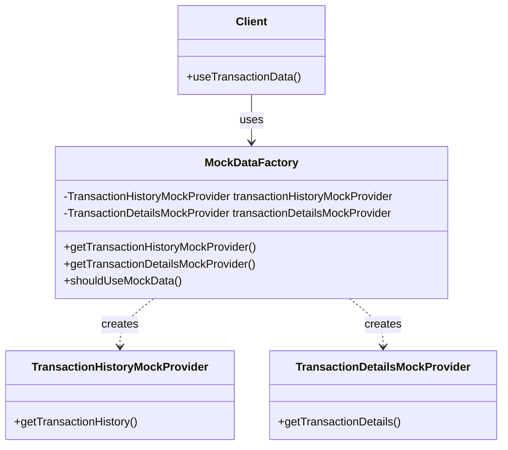

# Factory Pattern

## Visão Geral

O Factory Pattern é um padrão de design criacional que fornece uma interface para criar objetos em uma superclasse, mas permite que as subclasses alterem o tipo de objetos que serão criados. No contexto do Módulo de Transações, este padrão é utilizado para encapsular a lógica de criação de objetos complexos e desacoplar a instanciação da implementação.

## Implementação no Projeto

### MockDataFactory

A principal implementação do Factory Pattern no projeto é a classe `MockDataFactory`, que centraliza a criação de provedores de dados mockados para testes e desenvolvimento:

```java
public class MockDataFactory {
    
    private static final TransactionHistoryMockProvider transactionHistoryMockProvider = new TransactionHistoryMockProvider();
    private static final TransactionDetailsMockProvider transactionDetailsMockProvider = new TransactionDetailsMockProvider();
    
    public static TransactionHistoryMockProvider getTransactionHistoryMockProvider() {
        return transactionHistoryMockProvider;
    }
    
    public static TransactionDetailsMockProvider getTransactionDetailsMockProvider() {
        return transactionDetailsMockProvider;
    }
    
    public static boolean shouldUseMockData() {
        // Lógica para determinar se deve usar dados mockados
        return true;
    }
}
```

Esta implementação:
1. Encapsula a criação de provedores de dados mockados
2. Fornece métodos estáticos para acessar instâncias únicas (combinando com Singleton)
3. Oculta os detalhes de implementação dos clientes

## Benefícios no Projeto

1. **Centralização da Criação de Objetos**
   - Toda a lógica de criação de provedores de dados mockados está em um único lugar
   - Facilita a manutenção e alterações futuras

2. **Desacoplamento**
   - Os clientes não precisam conhecer os detalhes de implementação dos provedores
   - Permite trocar implementações sem afetar o código cliente

3. **Flexibilidade**
   - Facilita a adição de novos tipos de provedores de dados
   - Permite controlar quando usar dados reais ou mockados

## Diagrama



## Uso no Código

```java
// Exemplo de uso do Factory Pattern no código cliente
public class TransactionService {
    
    public List<TransactionHistoryDTO> getTransactionHistory(Long userId) {
        if (MockDataFactory.shouldUseMockData()) {
            // Usa o factory para obter o provider de dados mockados
            return MockDataFactory.getTransactionHistoryMockProvider().getTransactionHistory();
        } else {
            // Usa dados reais do repositório
            return transactionRepository.findByUserId(userId);
        }
    }
}
```

## Variações no Projeto

Além da implementação principal, o padrão Factory também aparece em outras formas no projeto:

1. **Factory Methods em Serviços**
   - Métodos que encapsulam a criação de objetos complexos
   - Exemplo: `createUser()` em `UserService`

2. **Builder Pattern (uma variação do Factory)**
   - Usado com Lombok para criar objetos com muitos parâmetros opcionais
   - Exemplo: `UserDTO.builder().name("John").email("john@example.com").build()`

## Considerações de Design

1. **Quando Usar**
   - Para encapsular a criação de objetos complexos
   - Quando a criação de objetos requer lógica que não deve ser exposta aos clientes
   - Para facilitar testes com dados mockados

2. **Alternativas Consideradas**
   - Dependency Injection: Útil para injetar implementações, mas o Factory oferece mais controle sobre a criação
   - Service Locator: Mais complexo e pode introduzir acoplamento global

3. **Evolução Futura**
   - Considerar a implementação de uma Abstract Factory para famílias de objetos relacionados
   - Explorar o uso de Providers configuráveis para diferentes ambientes (dev, test, prod)