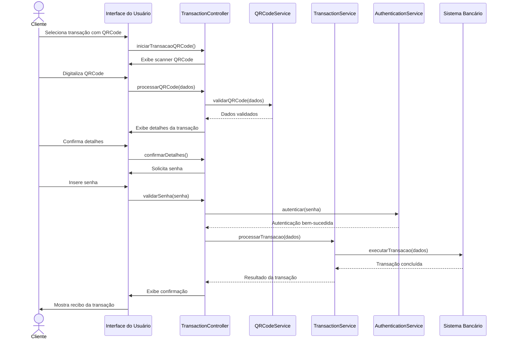
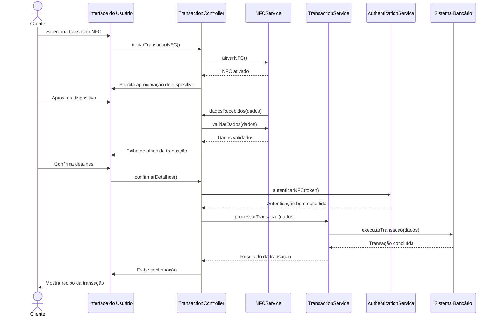
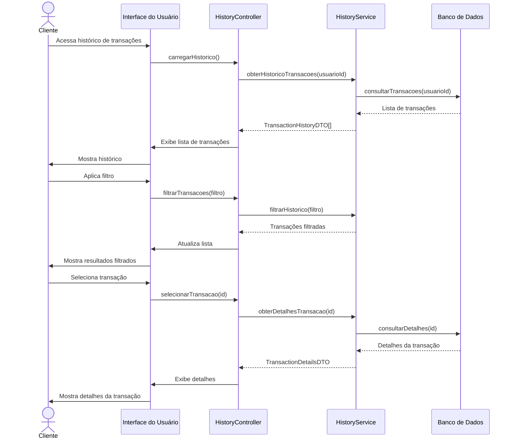
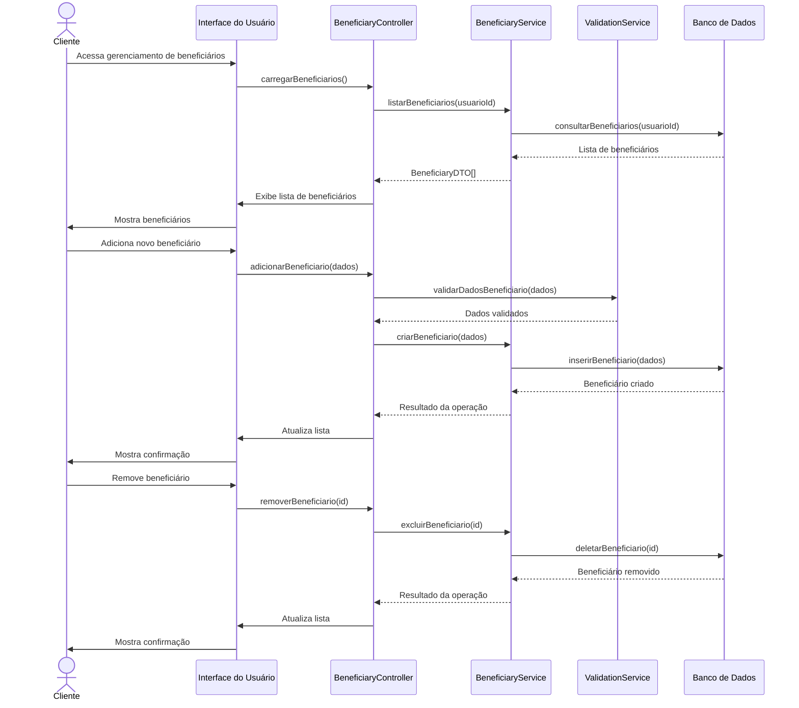
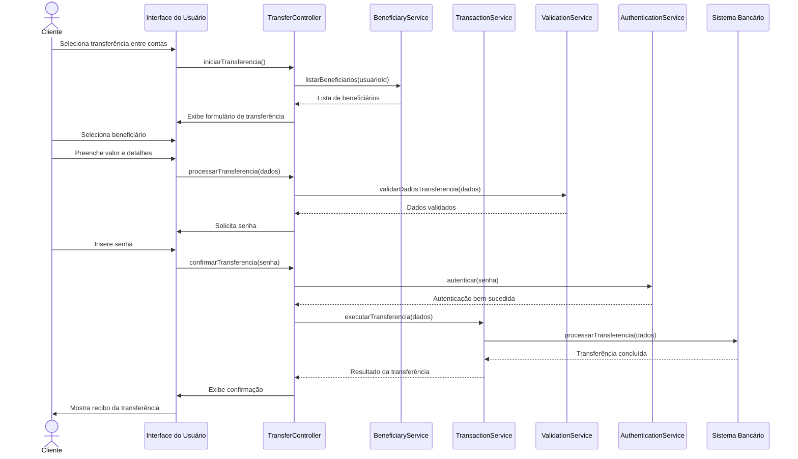
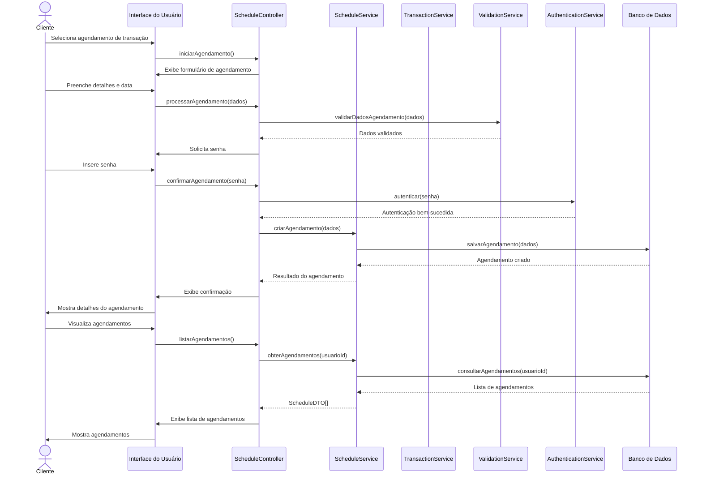
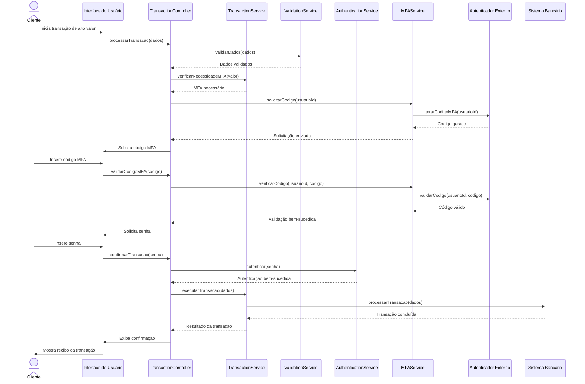

# Diagramas de Sequência

## Visão Geral

Os diagramas de sequência ilustram como os objetos interagem em um cenário específico de um caso de uso. Eles mostram a ordem cronológica das mensagens trocadas entre os objetos e são úteis para entender o fluxo de controle em um sistema orientado a objetos.

## 1. Realizar Transação com QRCode

Este diagrama mostra a sequência de interações quando um cliente realiza uma transação usando QRCode.

## 2. Realizar Transação com NFC

Este diagrama mostra a sequência de interações quando um cliente realiza uma transação usando NFC.

## 3. Visualizar Histórico de Transações

Este diagrama mostra a sequência de interações quando um cliente visualiza seu histórico de transações.

## 4. Gerenciar Beneficiários

Este diagrama mostra a sequência de interações quando um cliente gerencia seus beneficiários.

## 5. Realizar Transações entre Contas

Este diagrama mostra a sequência de interações quando um cliente realiza uma transferência entre contas.

## 6. Agendar Transação

Este diagrama mostra a sequência de interações quando um cliente agenda uma transação.

## 7. Realizar Transação com MFA

Este diagrama mostra a sequência de interações quando um cliente realiza uma transação com autenticação multifatorial.

## Padrões Comuns

Nos diagramas de sequência acima, podemos observar alguns padrões comuns:

1. **Validação de Dados**: Antes de processar qualquer operação, os dados são validados
2. **Autenticação**: Operações sensíveis exigem autenticação do usuário
3. **Padrão MVC/MVVM**: Separação clara entre interface do usuário, controladores e serviços
4. **Confirmação de Operações**: Após cada operação, o usuário recebe uma confirmação

Estes padrões garantem a segurança, consistência e usabilidade do sistema.