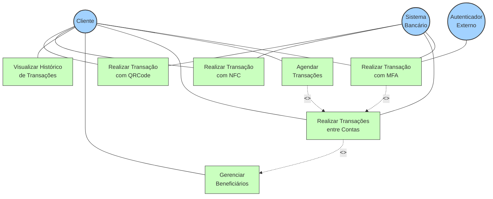
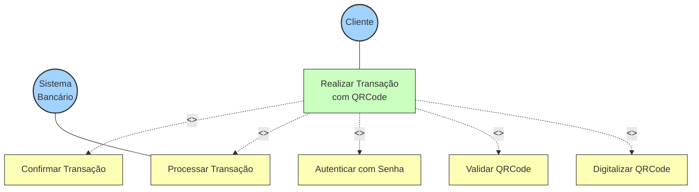
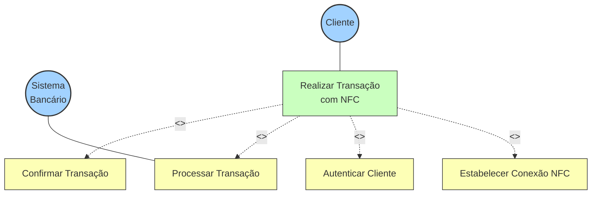
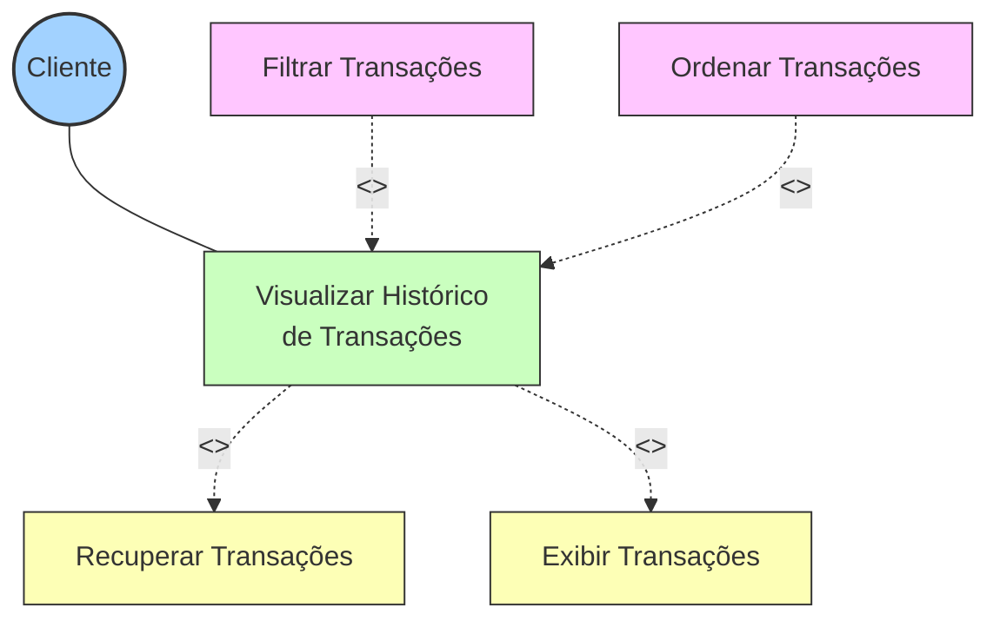
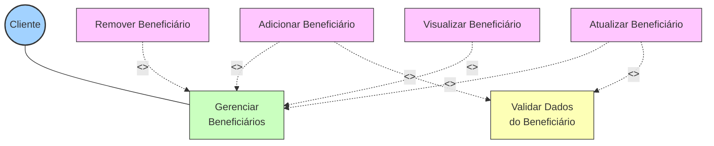
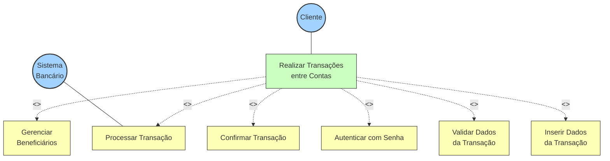
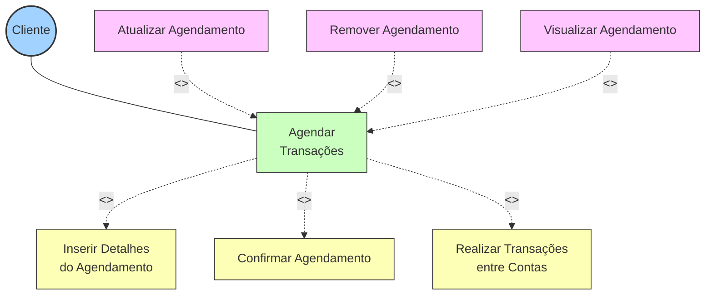
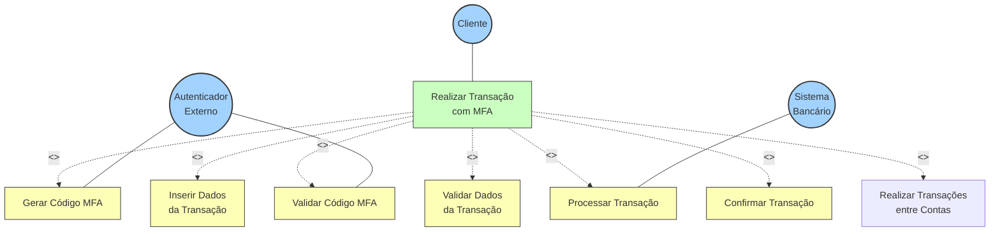

# Diagramas de Casos de Uso

## Visão Geral

Os diagramas de casos de uso representam as interações entre os usuários (atores) e o sistema. Eles são utilizados para capturar os requisitos funcionais do sistema e ilustrar como os diferentes atores interagem com as funcionalidades disponíveis.

## Atores Principais

- **Cliente**: Usuário final que utiliza o sistema para realizar transações financeiras
- **Autenticador Externo**: Sistema externo responsável pela autenticação multifatorial
- **Sistema Bancário**: Sistema externo que processa as transações financeiras

## Diagrama Geral

O diagrama abaixo apresenta uma visão geral de todos os casos de uso do sistema e suas relações:

## Casos de Uso Detalhados

### 1. Realizar Transação com QRCode (RN-01)

**Ator Principal**: Cliente

**Fluxo Principal**:
- Seleciona a opção de transação com QRCode
- Digitaliza o QRCode
- Valida o QRCode
- Exige senha
- Insere senha
- Valida a senha
- Processa a transação
- Recebe confirmação

**Diagrama**:

### 2. Realizar Transação com NFC (RN-02)

**Ator Principal**: Cliente

**Fluxo Principal**:
- Seleciona opção de transação NFC
- Estabelece conexão NFC
- Autentica o cliente
- Processa a transação
- Fornece confirmação

**Diagrama**:

### 3. Histórico de Transações (RN-03)

**Ator Principal**: Cliente

**Fluxo Principal**:
- Fornece histórico de transações
- Recupera transações
- Exibe transações
- Filtra ou ordena as transações

**Diagrama**:

### 4. Gestão de Beneficiários (RN-04)

**Ator Principal**: Cliente

**Fluxo Principal**:
- Adiciona beneficiário
- Valida dados do beneficiário
- Remove beneficiário
- Atualiza beneficiário
- Visualiza beneficiário

**Diagrama**:

### 5. Transações entre Contas (RN-05)

**Ator Principal**: Cliente

**Fluxo Principal**:
- Seleciona opção de transação
- Insere dados da transação
- Valida dados da transação
- Exibe senha
- Insere senha
- Valida a senha
- Processa a transação
- Exibe a confirmação

**Diagrama**:

### 6. Agendamento de Transação (RN-06)

**Ator Principal**: Cliente

**Fluxo Principal**:
- Agenda transação
- Insere detalhes
- Confirma agendamento
- Atualiza ou remove agendamento
- Exibe agendamento

**Diagrama**:

### 7. Transações com MFA (RN-09)

**Atores**: Cliente, Autenticador Externo

**Fluxo Principal**:
- Seleciona a opção de transação com MFA
- Insere dados para transação
- Valida os dados
- Exibe código
- Insere o código
- Valida a senha
- Processa a transação
- Mostra confirmação

**Diagrama**:

## Relacionamentos entre Casos de Uso

Alguns casos de uso possuem relacionamentos entre si:

1. **Inclusão (<<include>>)**: Um caso de uso inclui outro caso de uso como parte de seu fluxo
   - "Realizar Transações entre Contas" inclui "Gerenciar Beneficiários"
   - "Agendar Transações" inclui "Realizar Transações entre Contas"

2. **Extensão (<<extend>>)**: Um caso de uso estende outro caso de uso com comportamento adicional
   - "Transações com MFA" estende "Realizar Transações entre Contas" para valores elevados
   - "Filtrar Transações" estende "Visualizar Histórico de Transações"

## Requisitos Não-Funcionais

Além dos casos de uso funcionais, o sistema também deve atender a requisitos não-funcionais:

1. **Segurança**: Todas as transações devem ser criptografadas
2. **Desempenho**: Transações devem ser processadas em menos de 3 segundos
3. **Disponibilidade**: O sistema deve estar disponível 99,9% do tempo
4. **Usabilidade**: Interface intuitiva para todos os casos de uso
``